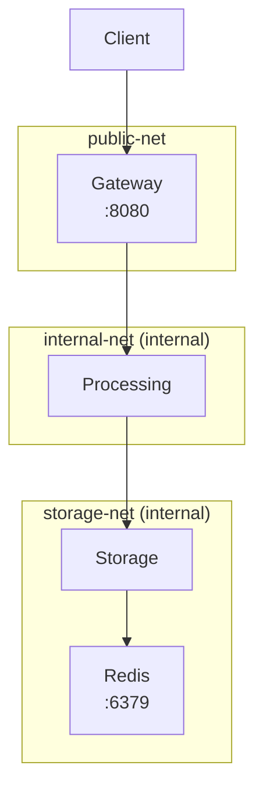

# MCLOUD-10: Docker Networking

В папке `networking` собрана микросервисная система из трех Spring Boot сервисов с сетевой изоляцией:

- `gateway` доступен с хоста на `http://localhost:8080`
- `processing` работает только во внутренней сети `internal-net`
- `storage` и `redis` изолированы в `storage-net`

## Архитектура



## Что делает каждый сервис

- `GatewayService` принимает внешний запрос `/process` и проксирует его в `processing`
- `ProcessingService` получает данные из `storage`, обрабатывает строку и возвращает результат
- `StorageService` читает payload из файла в `/data/storage-message.txt` и кеширует его в Redis

## Файлы модуля

- [pom.xml](C:\Users\Daniil\Desktop\docker_core\networking\pom.xml)
- [Dockerfile](C:\Users\Daniil\Desktop\docker_core\networking\Dockerfile)
- [docker-compose.yml](C:\Users\Daniil\Desktop\docker_core\networking\docker-compose.yml)
- [GatewayService.java](C:\Users\Daniil\Desktop\docker_core\networking\src\GatewayService.java)
- [ProcessingService.java](C:\Users\Daniil\Desktop\docker_core\networking\src\ProcessingService.java)
- [StorageService.java](C:\Users\Daniil\Desktop\docker_core\networking\src\StorageService.java)

## Запуск

```bash
docker compose up --build -d
docker compose ps
```

## Проверка

Проверка gateway:

```bash
curl http://localhost:8080/process
curl http://localhost:8080/health
```

Проверка health endpoints внутренних сервисов:

```bash
docker compose exec processing wget -qO- http://localhost:8080/health
docker compose exec storage wget -qO- http://localhost:8080/health
```

Проверка сетевой изоляции:

```bash
docker compose exec gateway wget -qO- http://processing:8080/process
docker compose exec processing wget -qO- http://storage:8080/storage/data
docker compose exec gateway wget -qO- http://storage:8080/storage/data
```

Последняя команда должна завершиться ошибкой, потому что `gateway` не подключен к `storage-net`.

## Полезные команды для сдачи

```bash
docker network ls
docker compose logs --tail=100
docker compose down -v
```

Для материалов к заданию нужно приложить:

- вывод `docker network ls` после запуска
- успешный ответ `curl http://localhost:8080/process`
- ссылку на ветку `feature/mcloud-10-networking`
- Pull Request в `master`
